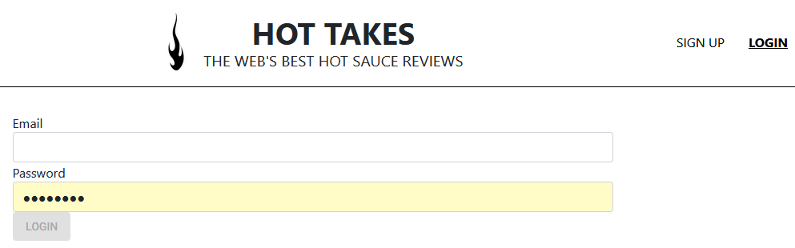
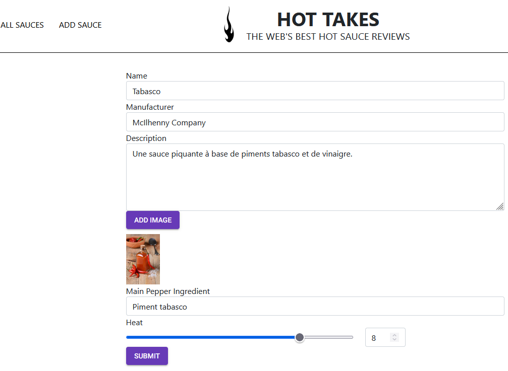
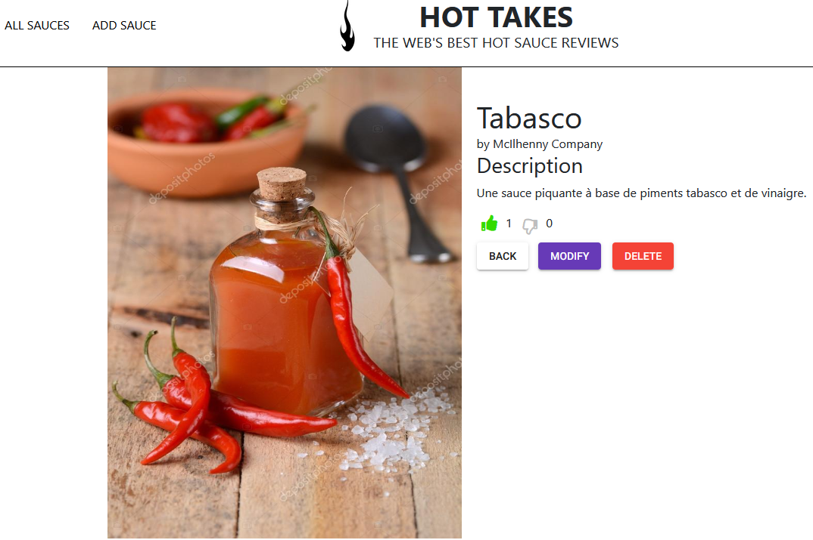

## Piiquante – 6th project of the OpenClassrooms web-developer path
## Table of Contents
1. [General Info](#general-info)
2. [Technologies](#technologies)
3. [Installation](#installation)
## General Info
***

The objective is to develop a hot sauce review web application (named Hot Sauces), allowing users to upload their favorite hot sauces and to like or dislike those shared by others
The different parts of this project were:
* build a noSQL database with MongoDB
* create a CRUD API with Node.JS and Express library in response to the specifications provided.
* manage image import when creating a sauce with the multer package
* manage user anthentication securely with JSON Webtoken
* improve API security with the Helmet module

Checkout here for more details about the technical specifications and mockups of this project :
* [technical_sepcifications]( Requirements_DW_P6.pdf)

Checkout the URL to take a look : https://lmleopold.github.io/Ohmyfood/
### Screenshots
|||
|||
## Technologies
***
A list of technologies used within the project:
* 
* 

|Libraries                                    |
|:--------------------------------------------|
|     |
||
|   |
|     |
| |
||
||

## Installation
***
### Back end prerequisites

You will need to have `Node` and `npm` installed locally on your machine. 
You will need a `MongoDB` Account

This project uses `.dotenv` to protect sensitive data related to the use of the MongoDB database. You must create a `.env`file at the root of the "backend" folder and add the following informations:
>IDENTIFIANT="enter your MongoDB username"
>PASSWORD="enter your MongoDB password"
>SECRET_KEY="enter your random secret token"

### Back end Installation ###

Clone this repo. From the "backend" folder of the project, run `npm install`. You can then run the server with `node server`. 
The server should run on `localhost` with default port `3000`. If the
server runs on another port for any reason, this is printed to the
console when the server starts, e.g. `Listening on port 3001`.

### Front end installation ###
From the "front" folder of the project, run `npm install`
run `npm run start`